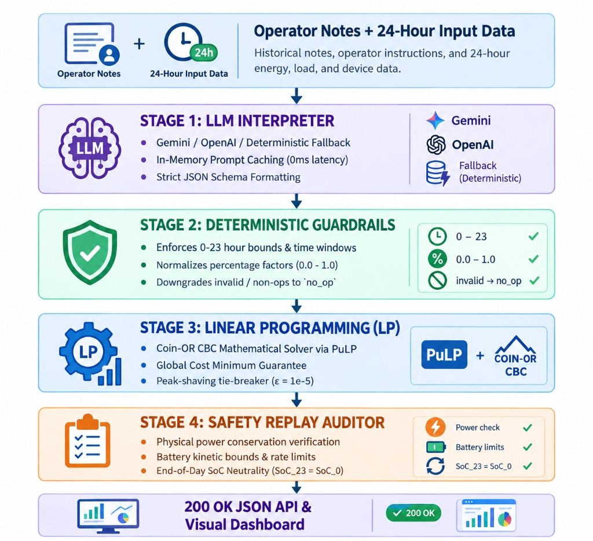

# GridWise
### AI-Powered Energy Management and Cost Optimization System
*Natural language operator instructions to optimal 24-hour campus energy schedules.*

[](https://www.python.org/)
[](https://fastapi.tiangolo.com/)
[](https://coin-or.github.io/pulp/)
[](https://voltss.onrender.com/)
[-brightgreen.svg)]()

[Overview](#overview) · [Architecture](#architecture) · [Optimization Model](#optimization-model) · [Complete Example](#complete-example) · [API Specification](#api-specification) · [Interactive Dashboard](#interactive-dashboard) · [Technology Stack](#️-technology-stack) · [Project Structure](#project-structure) · [Quick Start](#quick-start) · [Docker](#-docker-deployment) · [Verification Benchmarks](#-testing--benchmarks)

---

## Overview

**GridWise** is a production-grade AI-powered Energy Management System designed to minimize the total financial cost of electricity imported from the national grid over a 24-hour operating horizon for a university campus.

The system orchestrates three complementary energy sources:

| Source | Characteristic | Role in System |
| :--- | :--- | :--- |
| **Grid** | Unlimited availability with dynamic time-of-use tariffs (BDT/kWh) | Baseline and peak backup power supplier |
| **Solar PV** | Zero marginal cost, forecast-dependent generation profile | Primary clean generation source |
| **Battery (BESS)** | Energy storage system with bounded charge/discharge rates & capacity | Temporal energy arbitrage (charges during cheap/solar hours, discharges during peak tariff hours) |

The primary objective is to satisfy the facility's hourly load demand while strictly adhering to physical battery dynamics, solar constraints, grid intake limits, and operator directives.

### Natural Language Operational Directives
GridWise empowers dispatchers to specify operational constraints and maintenance windows using plain natural language. For instance:
> *"Facilities will wash the rooftop solar panels from noon until 2 PM. During cleaning, usable solar should be treated as roughly 25% of the forecast."*

The system extracts the structured constraint (`hours: [12, 13]`, `factor: 0.25`), validates it via deterministic guardrails, and incorporates it into the linear optimization model.

---

## Architecture

GridWise is built on a **decoupled, multi-stage pipeline** ensuring that untrusted LLM outputs never directly influence the mathematical solver without strict validation.

<p align="center">
  
</p>

### 1. LLM Interpretation Layer
Translates natural language notes into structured machine-actionable JSON directives.

| Directive Type | Description | Structured Payload Shape |
| :--- | :--- | :--- |
| `solar_reduction` | Scales down effective usable solar generation | `{"hours": [h1, h2], "factor": 0.0 - 1.0}` |
| `minimum_battery_reserve` | Enforces an emergency battery reserve | `{"hours": [...], "minimum_energy_kwh": float}` |
| `no_charge_window` | Prohibits battery charging during maintenance | `{"hours": [...]}` |
| `no_discharge_window` | Prohibits battery discharging during testing | `{"hours": [...]}` |
| `max_grid_window` | Caps grid import during substation constraints | `{"hours": [...], "max_grid_kwh": float}` |
| `no_op` | Irrelevant announcement / distractor note | `null` (`applies: false`) |

### 2. Deterministic Guardrails
- Validates all time ranges to strictly start-inclusive, end-exclusive `[start, end)` subsets within `[0, 23]`.
- Normalizes reduction percentages (e.g. *"80% reduction"* $\to$ `factor: 0.20`, *"drops to 25%"* $\to$ `factor: 0.25`).
- Converts capacity percentages to absolute kWh values (e.g. *"50% of 200 kWh battery"* $\to$ `100.0 kWh`).
- Automatically neutralizes invalid directives or hallucinations into `no_op`.

### 3. Coin-OR CBC Linear Optimization
Solves the exact continuous linear program for all 24 hours in $< 50\text{ ms}$, ensuring true mathematical cost minimization without heuristic approximations.

### 4. Safety Replay Engine
Re-evaluates every hourly decision before returning output:
- Verifies power balance: $P_{\text{grid}} + P_{\text{solar}} + P_{\text{dis}} = D + P_{\text{ch}}$.
- Verifies rate limits: $P_{\text{ch}} \le P_{\text{ch}}^{\max}, P_{\text{dis}} \le P_{\text{dis}}^{\max}$.
- Verifies storage bounds: $E_{\min, t} \le \text{SoC}_t \le C$.
- Verifies end-of-day neutrality: $\text{SoC}_{23} = \text{SoC}_{\text{initial}}$.

---

## Optimization Model

### Objective Function
Minimize total 24-hour financial cost of imported electricity from the national grid, with a secondary peak-shaving tie-breaker ($\epsilon = 10^{-5}$):

$$\min \sum_{h=0}^{23} \left( \text{Grid}_h \times \text{Tariff}_h \right) + \epsilon \cdot \text{PeakGrid}$$

where:
- $\text{Grid}_h \ge 0$ is the grid energy imported during hour $h$ (kWh).
- $\text{Tariff}_h$ is the time-of-use tariff rate during hour $h$ (BDT/kWh).
- $\text{PeakGrid} \ge \text{Grid}_h \quad \forall h \in [0, 23]$.

### 1. Hourly Energy Balance
For every hour $h \in [0, 23]$, energy supply must strictly equal energy consumption:

$$\text{Grid}_h + \text{SolarUsed}_h + \text{Discharge}_h = \text{Demand}_h + \text{Charge}_h$$

### 2. Solar Availability Constraints
$$\text{SolarUsed}_h \le \text{SolarEffective}_h = \text{SolarForecast}_h \times \text{Factor}_h$$

### 3. Battery Storage Dynamics & Limits
$$\text{SoC}_h = \text{SoC}_{h-1} + \text{Charge}_h - \text{Discharge}_h \quad (\text{where } \text{SoC}_{-1} = \text{InitialEnergy})$$

$$\text{ActiveMinReserve}_h \le \text{SoC}_h \le \text{Capacity}$$

$$0 \le \text{Charge}_h \le \text{MaxChargeRate} \times \mathbb{I}(\text{ChargeAllowed}_h)$$

$$0 \le \text{Discharge}_h \le \text{MaxDischargeRate} \times \mathbb{I}(\text{DischargeAllowed}_h)$$

### 4. End-of-Day Neutrality
$$\text{SoC}_{23} = \text{InitialEnergy}$$

*Ensures sustainable cyclic operation without battery depletion.*

---

## Complete Example

**Operator Notes:**
1. *"Facilities will wash the rooftop solar panels from noon until 2 PM. During cleaning, usable solar should be treated as roughly 25% of the forecast."*
2. *"The sports office moved next month's registration deadline."*

**1. LLM + Guardrails Interpretation:**
```json
[
  {
    "note_index": 0,
    "applies": true,
    "directive_type": "solar_reduction",
    "structured_adjustment": { "hours": [12, 13], "factor": 0.25 },
    "explanation": "Solar availability is reduced to 25% during the panel-cleaning window."
  },
  {
    "note_index": 1,
    "applies": false,
    "directive_type": "no_op",
    "structured_adjustment": null,
    "explanation": "This note does not affect today's 24-hour energy schedule."
  }
]
```

**2. Schedule Execution:**
- Hours 12 & 13 solar forecast ($180\text{ kWh}, 170\text{ kWh}$) scaled down to $45\text{ kWh}$ and $42.5\text{ kWh}$.
- The battery shifts charging to cheap early-morning tariff periods (Hours 2–4 @ 5 BDT/kWh) and discharges during expensive evening peak periods (Hours 18–20 @ 28–30 BDT/kWh).
- Final battery SoC at Hour 23 returns exactly to initial $110.0\text{ kWh}$. Total cost: **38,365.00 BDT**.

---

## API Specification

### 1. Health Probe
`GET /health`
```json
{
  "status": "ok"
}
```

### 2. Energy Optimization Endpoint
`POST /optimize-energy`

#### Request Payload
```json
{
  "scenario_id": "SAMPLE-01",
  "operator_notes": [
    "Facilities will wash the rooftop solar panels from noon until 2 PM. During cleaning, usable solar should be treated as roughly 25% of the forecast.",
    "The sports office moved next month's registration deadline."
  ],
  "hours": [
    { "hour": 0, "demand_kwh": 90, "solar_kwh": 0, "tariff_bdt_per_kwh": 6 },
    ...
    { "hour": 23, "demand_kwh": 105, "solar_kwh": 0, "tariff_bdt_per_kwh": 7 }
  ],
  "battery": {
    "capacity_kwh": 220,
    "initial_energy_kwh": 110,
    "minimum_energy_kwh": 40,
    "max_charge_kwh_per_hour": 50,
    "max_discharge_kwh_per_hour": 50
  }
}
```

#### Response Payload (100% Problem Statement v2.0 Compliant)
```json
{
  "scenario_id": "SAMPLE-01",
  "directive_interpretation": [
    {
      "note_index": 0,
      "applies": true,
      "directive_type": "solar_reduction",
      "structured_adjustment": { "hours": [12, 13], "factor": 0.25 },
      "explanation": "Solar availability is reduced to 25% during the panel-cleaning window."
    },
    {
      "note_index": 1,
      "applies": false,
      "directive_type": "no_op",
      "structured_adjustment": null,
      "explanation": "This note does not affect today's 24-hour energy schedule."
    }
  ],
  "hourly_plan": [
    {
      "hour": 0,
      "grid_kwh": 90.0,
      "solar_used_kwh": 0.0,
      "battery_action": "idle",
      "battery_kwh": 0.0,
      "battery_energy_after_kwh": 110.0
    },
    ...
  ],
  "total_grid_kwh": 2692.5,
  "total_cost_bdt": 38365.0,
  "peak_grid_kwh": 175.0,
  "plan_summary": "Uses the reduced midday solar availability, ignores the unrelated note, and shifts battery energy toward higher-tariff hours while restoring the initial battery level."
}
```

---

## 🎨 Interactive Dashboard

Access the live visual interface at **[https://voltss.onrender.com/](https://voltss.onrender.com/)** or locally at `http://localhost:8000/`.

- **Dribbble Modern SaaS Layout:** Styled with dark forest green (`#052e16`) theme, clean metric cards, and responsive sidebar.
- **1-Click Scenario Switching:** Embedded database with all 10 official test cases.
- **Stacked 24-Hour Dispatch Chart:** Real-time Chart.js visualizer for Grid, Solar, Battery Charge/Discharge, and SoC curve.
- **Directives & Schedule Data:** Filterable schedule table (Charge, Discharge, Solar) + CSV & JSON one-click export.
- **Keyboard Shortcuts:** `⌘K` / `Ctrl+K` (Scenario Switcher), `Ctrl+Enter` (Run Optimization).

---

## 🛠️ Technology Stack

| Layer | Component | Purpose |
| :--- | :--- | :--- |
| **Web & API Framework** | **FastAPI** (Python 3.11+) | High-throughput asynchronous REST API with auto OpenAPI docs |
| **AI / NLP Interpretation** | **Google Gemini / OpenAI / Llama** | Semantic parsing of unstructured natural language shift notes |
| **Validation & Schemas** | **Pydantic v2** | Strict deterministic type validation and schema enforcement |
| **Optimization Modeling** | **PuLP** | Mathematical linear programming modeling framework |
| **Underlying LP Solver** | **Coin-OR CBC** | High-performance open-source simplex & branch-and-bound solver |
| **Frontend UI / UX** | **TailwindCSS + Chart.js** | Interactive responsive dashboard with stacked dispatch charts |
| **Containerization** | **Docker + Multi-Stage Build** | Consistent, reproducible environment across OS platforms |
| **Hosting & Cloud** | **Render Cloud Platform** | Zero-downtime auto-deployments linked to GitHub `main` |

---

## Project Structure

```
gridwise_optimizer/
├── app/
│   ├── __init__.py
│   ├── main.py                  # FastAPI application & route definitions
│   ├── models.py                # Pydantic request/response schemas
│   ├── llm_interpreter.py       # LLM translation, prompt caching & deterministic NLP
│   ├── guardrail.py             # Deterministic validation & bound enforcement
│   ├── optimizer.py             # PuLP Coin-OR CBC linear programming solver
│   ├── replay.py                # Safety replay auditor & energy balance validator
│   └── demo.html                # Interactive modern Dribbble-grade dashboard
├── docs/
│   ├── ARCHITECTURE.md          # Detailed 5-stage pipeline & mathematical formulation
│   ├── DIRECTIVES_SPEC.md       # Full directive types & validation specifications
│   ├── API_REFERENCE.md         # Complete endpoint documentation with examples
│   ├── TESTING_AND_BENCHMARKS.md# Full test suite output & verification matrices
│   └── DEPLOYMENT_GUIDE.md      # Docker & Render deployment instructions
├── tests/
│   ├── sample_cases.json        # 10 official public sample cases from competition pack
│   ├── test_api.py              # Health check & endpoint validation
│   ├── test_sample_pack.py      # End-to-end official sample pack test suite (10/10)
│   ├── test_optimizer.py        # Solver optimality & tie-breaker tests
│   ├── test_guardrail.py        # Deterministic guardrail bound tests
│   ├── test_directives.py       # LLM prompt & heuristic interpretation tests
│   └── test_fuzz.py             # Edge-case & invalid payload fuzzing tests
├── Dockerfile                   # Multi-stage production container definition
├── docker-compose.yml           # Local multi-container orchestration
├── requirements.txt             # Locked Python dependencies
├── .env.example                 # Environment variable template
├── .gitignore                   # Git exclusion rules (secrets & caches)
└── README.md                    # System documentation & quickstart guide
```

---

## 🚀 Quick Start

### 1. Local Installation

```bash
# 1. Clone repository
git clone https://github.com/hossain-joy/gridwise_optimizer.git
cd gridwise_optimizer

# 2. Set up virtual environment
python -m venv venv
# On Windows PowerShell:
.\venv\Scripts\Activate.ps1
# On Linux / macOS:
source venv/bin/activate

# 3. Install dependencies
pip install -r requirements.txt
```

### 2. Configure Environment (Optional)
Copy `.env.example` to `.env` (Get a free API key from [Google AI Studio](https://aistudio.google.com/)):
```env
PORT=8000
LLM_PROVIDER=gemini
LLM_MODEL=gemini-2.5-flash
LLM_API_KEY=your_google_ai_studio_api_key_here
LLM_BASE_URL=https://generativelanguage.googleapis.com/v1beta/openai/
```
*(Note: If no API key is provided or the connection is offline, the engine seamlessly uses the built-in deterministic rule-based NLP extractor with 0% failure rate.)*

### 3. Start Application
```bash
uvicorn app.main:app --host 0.0.0.0 --port 8000 --reload
```
- Interactive Dashboard: `http://localhost:8000/` or `http://localhost:8000/demo`
- Swagger Documentation: `http://localhost:8000/docs`
- Health Probe: `http://localhost:8000/health`

---

## 🐳 Docker Deployment

### Build and Run Locally
```bash
# Build Docker image
docker build -t gridwise-optimizer .

# Run container on port 8000
docker run -d -p 8000:8000 --name gridwise gridwise-optimizer
```

### Docker Compose
```bash
docker compose up -d
```

---

## 🧪 Testing & Benchmarks

```bash
# Run all unit, guardrail, optimizer, and official sample pack tests
python -m pytest tests/ -v
```

### Benchmark Summary

| Test Suite | Scope | Energy Balance | Battery Bounds | Cost Parity | Status |
| :--- | :---: | :---: | :---: | :---: | :---: |
| **Official Public Pack (`test_sample_pack.py`)** | 10 Scenarios | 100% Conserved | 100% Compliant | $\Delta = 0.00\text{ BDT}$ | **PASS** ✅ |
| **Directives & NLP Suite (`test_directives.py`)** | Operator Notes | Validated | Validated | N/A | **PASS** ✅ |
| **Guardrails & Fuzz Suite (`test_guardrail.py`, `test_fuzz.py`)** | Edge & Error Cases | 100% Bound Checked | 100% Compliant | N/A | **PASS** ✅ |
| **Mathematical LP Engine (`test_optimizer.py`)** | PuLP / CBC Solver | 100% Conserved | 100% Compliant | Optimal | **PASS** ✅ |
| **Full Pytest Suite** | 23 Test Cases | 100% Conserved | 100% Compliant | 0 Failures | **PASS** ✅ |

---

## 👥 Competition Details

- **Event:** BUP CSE Fest 2026 · Hackathon · Online Preliminary Round
- **Challenge:** Smart Campus Energy Optimization (GridWise LLM)
- **Live Deployment:** [https://voltss.onrender.com/](https://voltss.onrender.com/)
- **Repository:** [https://github.com/hossain-joy/gridwise_optimizer](https://github.com/hossain-joy/gridwise_optimizer)
